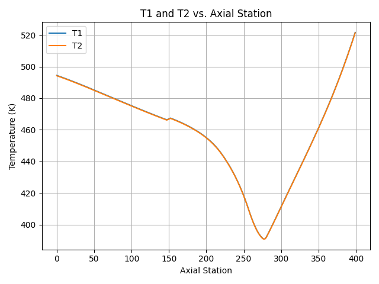

# Regen Cooling Analysis 🔥🚀

Python Simulation of a regenerative cooling wall for rocket engines. Developed as part of the Purdue Space Program (PSP)

## 📌 About the Project

This project is part of my first technical contribution to the **Purdue Space Program - Team Liquids**, focused on modeling **heat transfer** through a regenerative cooling channel in a rocket engine. 

The solver iterative calculates:
- Wall temperature distribution (`T1`, `T2`)
- Thermal resistances (`R1`, `R2`, `R3`)
- Heat flow balance at each axial station

The results are plotted and exported to a CSV file for further engineering analysis and validation.

## 🧠 Features

- Iterative solver using thermal resistance networks
- Temperature-dependent material properties
- CSV and graphical output of temperature profiles
- Implemented in **Python** with `NumPy` and `Matplotlib`

## 📂 Files

- `Regen_solver.py` → Main driver script
- `MATERIAL_PROPERTIES.py` → Material property handler
- `PSPSPdataReal.csv` → Input data per axial station
- `temperature_resistance_output.csv` → Output data file

## 📷 Example Output 

 

## 🧪 Dependencies

- Python 3.x
- NumPy
- Matplotlib
- CSV module (standard)

You can install dependencies with:
```bash
pip install numpy matplotlib
```

## ⚠️ Notes 

- The dataset used in this analysis (`PSPSPdataReal.csv`) was provided by the Purdue Space Program (PSP) and contains internal projects parameters.
- To respect the ownership and confidentiality of PSP's materials, this file is **not included** in the repository.
- The file `PSPSPdataDummy.csv` is a sample dataset created for demonstration purposes. It contains mock values but mantains the same column structure as the original dataset.
  
- The file `MATERIAL_PROPERTIES.py` is **not included** in this repository as it was provided internally by the Purdue Space Program Liquids team.
- If you are interested in accessing the material properties module or running the solver independently, please contact the team directly or use the provided `MATERIAL_PROPERTIES_TEMPLATE.py` as a placeholder.

## Reusability

This code is fuly functional and modular. If you already have a data set with similar structure (including tip temperature, bulk temperature, ambient temperature, cross-sectional areas, wall thickness, and fin resistances, etc.) you can plug your data directly into the pipeline.

This makes the project adaptable for:
- Rocket engine regenerative cooling analysis
- Thermal modeling of cylindrical components
- Any heat flow study requiring iterative thermal resistance solving

## 🧑‍💻 About me

I'm Joaquín, a freshman at Purdue University majoring in Aerospace Engineering. This project was developed as an introduction to regenerative cooling systems in liquid rocket engines, focusing on thermal resistance modeling and temperature distribution along the outer wall. 

Special thanks to **Jack Sloan** and **Anshuman Samanta** for their guidance and encouragement, this wouldn't have been possible without them. 

Feel free to reach out or connect with me on [LinkedIn](https://pe.linkedin.com/in/joaquin-alarcon)

## 📬 Contact:

- 📧 Email: joaq.alrc@outlook.com
- 🌐 Github : [@joaquinalarc](https://github.com/joaquinalarc)
- 📸 Instagram : [@joa.alarcon_](https://www.instagram.com/joa.alarcon_/)

## 💖 Support:

Liked this project? Help me keep building rockets (and maybe buy some coffee too):

☕ [Donate via Paypal](https://www.paypal.me/joaquix96)
